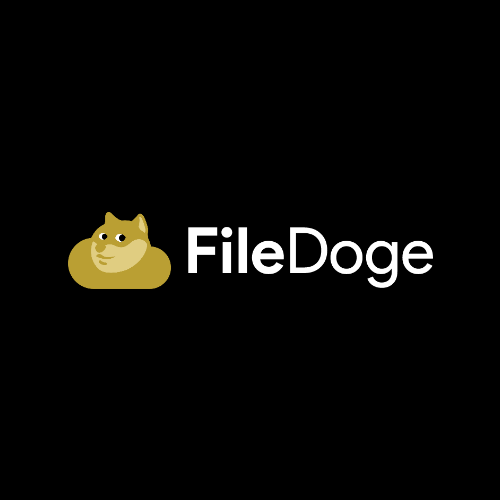

# FileDoge Telegram Bot

Telegram files to FileDoge upload - bot, returning download links after upload.



## Tech Stack

- Backend: Node
- Framwork: Express
- Bot SDK: Telegraf

## Installation

Clone and Install the required packages for filedoge-telegram-bot with npm

```bash
git clone https://github.com/kurdi-dev/filedoge-telegram-bot.git
cd filedoge-telegram-bot
npm i
```

## Run Locally

Clone the project

```bash
git clone https://github.com/kurdi-dev/filedoge-telegram-bot.git
```

Go to the project directory

```bash
cd filedoge-telegram-bot
```

Install dependencies

```bash
npm install
```

Update `.env` file, see Environment Variables section

Start the server

```bash
  npm run start
```

## Environment Variables

To run this project, you will need to add the following environment variables to your .env file, check `.env.example`.

`TELEGRAM_TOKEN`: Api token given by Telegram BotFather.

`BOT_SERVER_URL`: your production server URL, leave it blank while developing localy, check setWebhook method inside `index.js:228`

## Deployment

### Deploy to [Heroku](https://www.heroku.com)

To deploy this project on Heroku, after cloning the re and loging in run

```bash
heroku create
```

Update/Set Environmental Varibales:

```bash
heroku config:set TELEGRAM_TOKEN=<your botfather bot token>  BOT_SERVER_URL=<your newly created Dyno URL>
```

Then, push the code to Heroku

```bash
git push heroku main
```

PS: you might have to restart the Dyno to reconfigur the new seted environment variables.

### Deploy to [Deta](https://deta.sh)

To deploy this project on Deta, after loging in run

```bash
deta new --node
```

Update your `BOT_SERVER_URL` varibale inside `.env` file according to the newly created Micro's endpoint URL.

See the Micro's endpoint url:

```bash
deta details
```

After updating the `.env` file, update the online Micro's environment variables from the local `.env` file with the deta update command:

```bash
deta update -e .env
```

Then, deploy the bot to Deta:

```bash
deta deploy
```

## License

[MIT](https://choosealicense.com/licenses/mit/)
